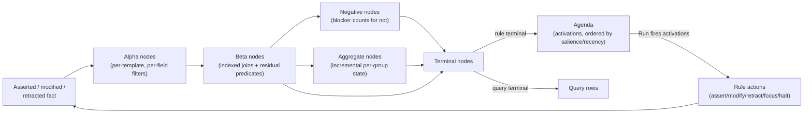
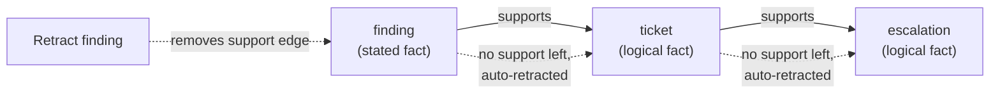
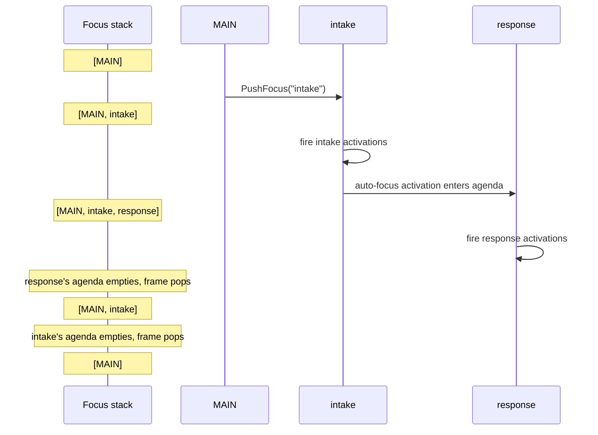

# Advanced behavior

This guide covers the runtime machinery behind the concepts in
`concepts.md`: the Rete graph, expression predicate placement, aggregates,
higher-order conditions, logical support, backward chaining, and module
focus.

## The Rete runtime

The compiled Rete graph is the only production matching runtime. Compiling
a ruleset builds a graph of:

- Alpha nodes: per-fact filters routed by template, then by literal field
  constraints. Equality constraints become indexed routes, so a fact only
  reaches the alpha memories it can match.
- Beta nodes: joins between the partial matches on the left and facts on
  the right. Equality join constraints compile to indexed hash joins;
  other comparisons and residual predicates evaluate per candidate pair.
- Negative nodes: `not` conditions maintain a blocker count per left row;
  a row produces output only while its count is zero.
- Aggregate nodes: maintain per-group aggregate values incrementally.
- Terminal nodes: rule endpoints that feed the agenda and query endpoints
  that produce rows.



Every arrow is a delta, not a full re-scan: one changed fact propagates
only through the alpha and beta memories it actually reaches.

Asserts, modifies, and retracts propagate through the graph as deltas.
Tokens (partial matches) carry a commutative identity hash so removals
resolve without scanning memories again. The agenda updates from terminal
deltas: new tokens add activations, removed tokens cancel pending ones.

Within a module, activations fire in a deterministic order: higher
salience first, then higher recency (more recently touched facts), then
earlier declaration order, with stable tie-breaking after that.

Rule shapes the graph can't represent fail compilation or session
construction with an error wrapping `rules.ErrUnsupportedRuntime` rather
than falling back to a slower matcher.

## In-place modify

`(modify ?binding (set ...) (unset ...))` changes a fact's slots in place and
**preserves its fact identity**: the fact keeps the same `FactID` and recency
lineage across the modify, so downstream rules, queries, and support edges that
reference it continue to do so. The modify propagates as remove-then-add
deltas: the fact is re-tested against every pattern, so it can newly match rules
whose conditions the old slot values didn't satisfy, and unmatch rules the old
values did.

A rule that modifies a fact it matched does not necessarily loop. When the new
slot values no longer satisfy the rule's own left-hand side, the fact stops
matching and the rule does not re-activate — the common `(defrule r ?f <-
(order (status "new")) => (modify ?f (set (status "shipped"))))` fires once. A
rule whose modified fact still matches its own left-hand side would re-activate;
gate that with a status slot that the modify changes, or a guard condition, so
the rule stops matching after it fires.

Modifying a fact held up purely by logical support is rejected with
`ErrLogicalFactModify` (see below): its slots are entailed by its support, so
change the supporting facts instead.

## Expression predicate placement

The compiler classifies every expression predicate on a condition:

- Alpha placement: the expression reads only the condition's own fact. It
  runs once per fact before any joins, and simple comparisons are lowered
  further into field constraints that can use indexes.
- Beta-residual placement: the expression reads bindings from earlier
  conditions, so it must run after the join, once per joined token.

Placement is automatic and can be inspected through
`rules.ExpressionPredicate.Placement()`.

:::tip
Filters that read one fact are cheap and often indexed, while
cross-binding comparisons pay a per-join-result cost. Where possible,
phrase constraints against a single fact, and prefer equality joins, which
use hash indexes.
:::

Conjunctions split: in an `and` expression, single-fact conjuncts hoist to
alpha placement even when a sibling conjunct stays residual.

## Aggregates

`accumulate` conditions group by the partial match from the preceding
conditions: each combination of earlier bindings gets its own aggregate
bucket over the facts matching the input condition. Empty groups are
valid — `count` reports zero and `collect` reports an empty list.

Maintenance is incremental. Asserting a matching fact folds into the
bucket; retracting subtracts where that's sound (counts and integer sums)
and rebuilds the bucket where it isn't (minimum and maximum when the
departing value ties the current extreme, float sums, and `collect`). A bucket
only re-emits downstream when its value actually changes.

Branches may contain multiple `accumulate` conditions. Each result becomes
part of the partial match consumed by later aggregate and join stages; chained
changes settle before terminal agenda deltas are emitted.

`collect` results are deterministically ordered, but not in insertion
order. Aggregates aren't allowed under `not`, and a standalone `test` over
an aggregate result isn't supported; compare aggregate results in actions
or downstream facts instead.

## Higher-order conditions

- `not` matches while no fact satisfies its condition, maintained by
  blocker counts. Bindings inside a `not` are local.
- `exists` matches while at least one fact satisfies its condition and
  produces exactly one activation regardless of how many facts match.
  Contributor churn that doesn't change the truth value produces no agenda
  churn.
- `forall(domain, requirement)` matches while every fact matching the
  domain also has a matching requirement fact. It's vacuously true when
  the domain is empty. Internally it compiles to counterexample negation:
  no domain match without its requirement.

:::caution
Limits, enforced at compile time with errors wrapping
`rules.ErrInvalidHigherOrderCondition`: disjunction and negation may be nested
inside `exists` and `forall`, and higher-order conditions may be nested under
`not`. A top-level `or` branch containing a higher-order condition and sibling
sequential higher-order conditions in one `and` are not yet supported.
Aggregates inside higher-order scopes are rejected. Bindings inside `not`,
`exists`, and `forall` don't escape.
:::

## Logical support and truth maintenance

`AssertLogical` (from an action context, or `assert-logical` in `.gess`)
asserts a fact whose justification is the asserting activation's matched
facts. The session records a support edge per asserting activation.



Retracting the root stated fact removes its support edge; each downstream
logical fact loses its only support in turn and is retracted automatically,
cascading until nothing more depends on what's gone.

- A fact can be stated, logical, or both. Asserting an existing logical
  fact adds stated support; retracting a stated-and-logical fact removes
  only the stated support.
- When a supporting match goes away, because a supporting fact was
  retracted or modified out of the match, the support edge is removed. A fact whose
  last logical support disappears and that has no stated support is
  retracted automatically, and that retraction cascades through any facts
  it supported in turn.
- Stated support is sticky: losing logical support never retracts a stated
  fact.
- Directly retracting a logical-only fact fails with
  `ErrLogicalOnlyRetract`; modifying any fact with logical support fails
  with `ErrLogicalFactModify`. Change the supporting facts instead.

Inspect the state with `Snapshot.SupportGraph()`, which returns the edges
(with rule, activation, and supporting fact identities) and counters,
including cascade retraction totals and cascade depth. The
`EventLogicalSupportAdded` and `EventLogicalSupportRemoved` events track
edge lifecycle. `Reset` clears all logical support.

## Explaining facts

Logical support and mutation lineage answer *why a fact exists*, but you
normally have to piece that together from the support graph and the event
stream. `Explain` returns it as one typed, renderable structure.

A `Derivation` carries the fact, its `FactSupportState`, the `Firing` that
produced it (rule, activation, rendered `.gess` action source, and — with
firing-time capture — the bound values the action evaluated), the facts it
logically depends on (recursively, cycle-guarded), and its
assert→modify… `History` for the current generation.

There are two tiers:

- **`Snapshot.Explain(id, opts…)` (tier 1)** is a pure read of a
  session-produced snapshot. It always works and allocates only at call
  time. It fills the support state and the recursive logical-support tree,
  and, for logically-supported facts, the producing rule from the support
  edge. It does not know the lineage of *stated* facts — that needs a log.

  ```go
  snap, _ := session.Snapshot(ctx)
  derivation, ok := snap.Explain(factID)
  ```

- **`Session.Explain(ctx, id, opts…)` (tier 2)** adds the producing firing
  (with rendered action source) and the `History` for the fact and its
  supporters, reconstructed from an opt-in event log. Attach the log with
  `session.WithExplainLog()`; without it, `Session.Explain` returns
  `ErrExplainLogUnavailable` and you fall back to `Snapshot.Explain`.

  ```go
  session, _ := session.New(ruleset, session.WithExplainLog())
  // …assert, run…
  derivation, err := session.Explain(ctx, factID)
  ```

The log is bounded (`WithExplainLogMaxEntries`, default 4096). When a fact's
earliest entries are evicted, its reconstructed `History` is reported with
`Truncated` set — never silently dropped. `Reset` clears the log, and a
`Fork` does not inherit it (pass `WithExplainLog` to the fork to record
lineage there; event sequences continue from the parent).

Recursion is bounded by `WithExplainMaxDepth` (default 64) and
`WithExplainMaxNodes` (default 10000); a node cut short by a cap or a cycle
revisit is marked `Truncated`.

Reconstruction from the event stream alone cannot recover computed or scalar
bindings (`?total` from `(+ ?subtotal ?tax)`), so `Firing.BindingsPartial`
is set honestly; a session that captures bindings at firing time reports
them exactly with `BindingsPartial` unset.

Render a derivation as an indented text tree with `Derivation.String()` or as
a Graphviz digraph with `Derivation.DOT()`. In the REPL, `explain <fact-id>`
prints the tree and `explain <fact-id> dot` prints the graph.

### Why a rule did not fire

The most common rules-engine question — *why didn't my rule fire?* —
`Session.WhyNot(ctx, ruleName)` answers structurally by reading the live Rete
memories the engine matches with. It never mutates the runtime and adds no
per-fact state; it re-executes predicates only along the probed chain at call
time, and is idle-only under the same guard as `Agenda`.

A `WhyNotReport` has an `Outcome`:

- `WhyNotActivated` — the rule *is* pending (the report lists the activations).
- `WhyNotAlreadyFired` — it matched and fired; the activation is refracted.
- `WhyNotNeverMatched` — no branch completed; each branch's first failing
  condition is classified.
- `WhyNotBlocked` — the closest branch failed on a negated condition currently
  blocked by one or more facts (the report names them).

Per branch, each condition reports its authored and planned order, whether it
is satisfied, its alpha match count, and — on the first failing condition — a
typed `Reason` (`no_alpha_matches`, `join_mismatch`, `predicate_rejected`, or
`negation_blocked`), the rejecting constraint's `SourceSpan`, and the blocking
facts for a negation. The deepest surviving partial matches are reported as
near-misses with their bound values.

```go
report, err := session.WhyNot(ctx, "escalate-critical")
// report.Outcome, report.Branches[0].Conditions[i].Reason, …
```

`WhyNotReport.String()` renders an answer-shaped diagnosis, and the REPL
`whynot <rule>` command prints it — for example, `whynot ship-order` on a
loaded `.gess` ruleset points at the failing condition with its
`file:line:col` location. Partial-match and probe work are bounded by
`WithWhyNotMaxPartialMatches`, `WithWhyNotMaxBlockers`, and
`WithWhyNotMaxProbedRows`; a cap sets the report's `Truncated` flag.

## Backward chaining

Backward chaining makes rules prove facts on demand instead of eagerly.

1. Declare a template backchain-reactive with
   `(declare (backchain-reactive TRUE))` in `.gess` or
   `BackchainReactive: true` in a `TemplateSpec`.
   Compilation synthesizes a demand template named `need-<template>` with
   the same slots.
2. Write proof rules that match the demand fact and assert the real fact:

   ```cl
   (defrule direct-reachability
     ?need <- (need-reachable (src ?src) (dst ?dst))
     (edge (src ?src) (dst ?dst))
     =>
     (assert (reachable (src ?src) (dst ?dst))))
   ```

3. When a join needs a `reachable` fact that doesn't exist, the runtime
   generates a `need-reachable` demand with the slot values it can
   determine from the join; unknown slots stay unconstrained. Proof rules
   can themselves demand further facts, so transitive and recursive proofs
   work.

Session queries drive demand too: `Query` and `QueryAll` against
backchain-reactive templates inject the query's constraints as demand and
fire only activations descended from that query's transient demand. Selection
preserves the normal salience and recency priority among proof activations;
unrelated activations stay pending, and there is no built-in firing limit on
the proof run. When the run finishes, the query answers from working memory
and retracts the transient demand facts it created; facts asserted by proof
rules persist.
Queries that generate no demand have a no-side-effect contract. Snapshot
queries never generate demand: a snapshot query that would require backward
chaining fails with `ErrUnsupportedRuntime`.

Conditions wrapped in `rules.Explicit{...}` and negated conditions never
generate demand. Sessions are unbounded by default; use
`session.WithMaxDemandCascadeSteps(n)` to stop a runaway cascade with a typed
`session.DemandCascadeLimitError`. The bound spans all demands raised during
one `Run` or query proof. Proof selection is independent of the module focus
stack, so proof rules may live in modules that are not currently focused. The
[`examples/backward-chaining`](https://github.com/cpcf/gess/tree/main/examples/backward-chaining)
examples show the pattern end to end.

## Modules and the focus stack

Every rule belongs to a module; the agenda is partitioned per module. The
session's focus stack (initially `[MAIN]`) selects which partition fires:



- `Run` draws activations only from the module on top of the stack. When
  that module's agenda empties, the frame pops automatically and the run
  continues with the module below; an empty stack falls back to `MAIN`.
- Activations in a non-`MAIN` module that never gains focus stay pending
  across runs.
- Auto-focus, declared per rule or as a module default, pushes the
  module onto the stack the moment one of the rule's activations enters
  the agenda.
- Applications control focus with `PushFocus`, `SetFocus`, `PopFocus`, and
  `ClearFocusStack` on the session; actions use the same methods on the
  action context or the `.gess` `focus`, `pop-focus`, and `clear-focus`
  actions. Focus changes from actions affect the very next activation
  selection.
- `Reset` restores the initial focus stack.

Use modules to phase work, for example an intake module that normalizes
facts followed by a response module that acts on them, with rules or the
host pushing focus between phases. The
[`examples/modules-focus`](https://github.com/cpcf/gess/tree/main/examples/modules-focus)
example shows the pattern.

## Next steps

- [Examples map](examples.md) for runnable examples of each mechanism
  covered here.
- [Session lifecycle](session-lifecycle.md) for the host-facing API these
  mechanisms build on.
- [Developer guide](contributing.md) for the engine's internal
  architecture.
