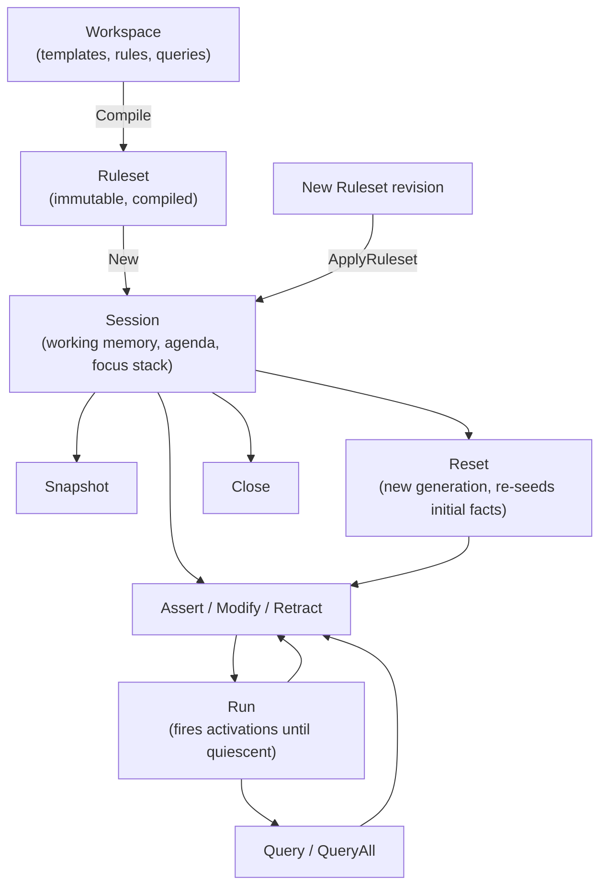

# Session lifecycle

A session owns the mutable runtime state for one compiled ruleset: working
memory, the agenda, the focus stack, and logical support. This guide covers
the full lifecycle from construction to close. For the package overview, see
`go-api.md`; for concepts, see `concepts.md`.



A session's own state machine loops through mutate/run/query until the host
resets it, swaps in a new compiled ruleset, or closes it.

All examples use the public packages:

```go
import (
	"github.com/cpcf/gess/rules"
	sess "github.com/cpcf/gess/session"
)
```

## Creating a session

```go
session, err := sess.New(ruleset,
	sess.WithInitialFacts(initials...),
)
if err != nil {
	return err
}
defer session.Close()
```

`sess.New` compiles the initial facts, builds the Rete runtime, seeds working
memory, and computes the initial agenda. Options:

- `WithSessionID(id)`: set the session identifier returned by `ID()`.
- `WithEventListener(listener)`: register an event listener. Repeat the
  option to register several.
- `WithEventClock(clock)`: override the timestamp source for events.
- `WithInitialFacts(initials...)`: facts present at construction and
  re-asserted by every `Reset`. Generated `.gess` code returns these from
  `deffacts` declarations.
- `WithResetBeforeSnapshot(enabled)`: when enabled, a successful `Reset`
  includes a pre-reset snapshot in `ResetResult.Before`.

`Close` marks the session closed; later calls return closed statuses and
`ErrClosedSession`.

## Asserting facts

Two entry points assert facts, both against a declared template:

- `Assert(ctx, templateKey, fields)`: assert a fact of the template
  addressed by key, validated against its slots.
- `AssertTemplateValues(ctx, templateKey, values...)`: assert with values in
  template field order, skipping field-map construction.

Build fields with `rules.NewFields`, `rules.NewFieldsFromPairs`, or
`rules.MustFields`:

```go
result, err := session.Assert(ctx, rules.TemplateKey("order"),
	rules.MustFields("id", "O-400", "customer", "C-100", "sku", "SKU-1"))
```

`AssertResult.Status` reports what happened:

- `AssertInserted`: a new fact entered working memory.
- `AssertExisting`: the template's duplicate policy matched an existing
  fact with identical fields; the error is nil and `Fact` identifies the
  existing fact.
- `AssertReplaced`: a `unique-key` template matched an existing fact whose
  non-key fields differed, so the old fact was retracted and a new fact
  (with a new fact ID) was inserted in its place; `Fact` identifies the
  replacement.
- `AssertValidationFailure`: the fields failed template validation; the
  error wraps `rules.ErrValidation`.

The result also carries the inserted `FactSnapshot` and a `MutationDelta`
describing the change. Use `result.Inserted()` to test for a new fact.

### Duplicate policies

Each template has a duplicate policy that decides how a colliding assert
resolves: `structural` deduplicates facts with identical fields, `allow`
permits duplicates, and `unique-key` keeps one current fact per key.
Asserting a `unique-key` fact whose key matches an existing fact but whose
non-key fields differ replaces the old fact. It behaves like a retract of
the old fact followed by an assert of the new one, so the agenda,
aggregates, queries, logical support, and any downstream derived facts all
observe the change; asserting an identical fact is a no-op. Asserting a fact
that already exists as a logical-only fact adds stated support to it and
returns `AssertExisting`.

## Modifying facts

```go
result, err := session.Modify(ctx, factID, sess.FactPatch{
	Set:   rules.MustFields("lane", "standard"),
	Unset: []string{"warehouse"},
})
```

`Modify` applies a patch of set and unset fields. The fact keeps its
`FactID`; its `FactVersion` and recency advance. Statuses:

- `ModifyChanged`: fields changed and propagated.
- `ModifyNoOp`: the patch made no difference; nil error.
- `ModifyMissing`: no such fact (`ErrFactNotFound`).
- `ModifyStale`: the ID belongs to an earlier generation, before a `Reset`
  (`ErrStaleFactID`).
- `ModifyValidationFailure`: the patched fact fails template validation.
- `ModifyDuplicate`: the patch collides with another fact under a policy
  that deduplicates (`ErrDuplicateFact`).
- `ModifyLogicalSupport`: the fact has logical support and can't be
  modified (`ErrLogicalFactModify`).

## Retracting facts

```go
result, err := session.Retract(ctx, factID)
```

Statuses:

- `RetractRemoved`: the fact left working memory. Logical facts that
  depended on it cascade away in the same operation.
- `RetractStatedSupportRemoved`: the fact had both stated and logical
  support; the stated support was removed and the fact survives as
  logical-only.
- `RetractLogicalOnly`: the fact exists only through logical support and
  can't be retracted directly (`ErrLogicalOnlyRetract`). Retract its
  supporting facts instead.
- `RetractMissing` and `RetractStale`: as for `Modify`.

## Running rules

```go
result, err := session.Run(ctx)
```

`Run` fires activations until quiescence: it repeatedly selects the next
activation from the focused module, executes its actions, applies the
resulting agenda changes, and stops when no activation remains. The
`RunResult` carries a per-session `RunID`, the number of activations fired,
and a status:

- `RunCompleted`: the agenda emptied.
- `RunHalted`: an action called `Halt()`. The halting activation's remaining
  actions still run; pending activations stay on the agenda and a later
  `Run` continues from them.
- `RunFireLimit`: `WithMaxFirings(n)` stopped the run after `n` activations;
  pending activations remain and a later `Run` continues from them.
- `RunCanceled`: the context was canceled between actions (`ctx.Err()`).
- `RunActionFailed`: an action returned an error; the returned error is an
  `ActionFailureError` that unwraps to the cause and matches
  `rules.ErrActionFailed`.
- `RunConcurrencyMisuse`: a `Run` overlapped another `Run`.

:::note
Use `WithMaxFirings(n)`, context cancellation, or `Halt()` to bound a run.
Without one of those controls, a runaway rule cycle can run indefinitely.
:::

### Activation order

Within the focused module, higher-salience activations fire first. The focus
stack decides which module's agenda is active; see the focus section later
in this guide.

## Queries

```go
rows, err := session.QueryAll(ctx, "routes-by-lane",
	sess.QueryArgs{"lane": "expedite"})
for _, row := range rows {
	order, _ := row.Value("order")
	fact, _ := row.Fact("route")
	_ = order
	_ = fact
}
```

- `QueryAll` returns all rows. `Query` returns a `QueryIterator` with
  `Next(ctx)` and `All(ctx)`; rows are materialized when the query executes.
- `QueryArgs` maps parameter names (without the `?`) to Go values. Unknown
  names, missing parameters, and kind mismatches wrap `ErrQueryArgument`;
  an unknown query name wraps `ErrQueryNotFound`.
- Each `QueryRow` exposes `Aliases()`, `Fact(alias)` for fact-binding
  returns, and `Value(alias)` for scalar returns.
- Rows are deterministic for a fixed session history, but otherwise have no
  ordering guarantee. Sort them explicitly when callers require an order.

Session queries drive backward chaining: running a query against
backchain-reactive templates generates demand and then fires only activations
descended from that query's transient demand. Proof selection uses normal
salience and recency ordering but does not depend on the focus stack;
unrelated activations stay pending for a later `Run`. Facts derived during
the proof persist in working memory after the query returns; only the
transient demand facts the query created are cleaned up. Queries that generate
no demand have no side effects. Snapshot queries never generate demand: a
snapshot query that would need backward chaining fails with
`ErrUnsupportedRuntime`. See `advanced.md`.

## Snapshots

```go
snap, err := session.Snapshot(ctx)
for _, fact := range snap.Facts() {
	fmt.Println(fact.Name(), fact.Fields())
}
```

`Snapshot` returns an immutable view of working memory: facts in
deterministic insertion order, lookup by ID, name, or template key, the
logical `SupportGraph()`, backchain demand diagnostics, and snapshot-scoped
`Query`/`QueryAll`. Snapshots don't change after later mutations.

`DiffSnapshots(before, after)` reports the working-memory difference between
two snapshots: facts added, retracted, and modified by field value or support
state, in deterministic fact-id order.

## Durable checkpoints

An idle session can be checkpointed, encoded, and restored in another process:

```go
checkpoint, err := session.Checkpoint(ctx)
if err != nil {
	return err
}
if err := sess.EncodeCheckpoint(writer, checkpoint); err != nil {
	return err
}

decoded, err := sess.DecodeCheckpoint(reader)
if err != nil {
	return err
}
restored, err := sess.Restore(ctx, ruleset, decoded,
	sess.WithSessionID("restored-worker"),
	sess.WithEventListener(listener),
)
```

The checkpoint preserves exact fact identities, versions, recency and field
presence; initial facts and globals; pending agenda order and fired-match
refraction; focus state; logical-support edges; backchain demand state; and
the sequence allocators used by later mutations, runs, and events. The
compiled graph itself is never serialized. `Restore` requires a freshly
compiled ruleset with the checkpoint's `RulesetID` and rebuilds graph memory
from the decoded semantic state.

`DecodeCheckpoint` accepts the versioned canonical JSON format and bounds
input at `DefaultCheckpointMaxBytes`. Malformed or inconsistent input wraps
`rules.ErrInvalidCheckpoint`; an unsupported envelope version wraps
`rules.ErrUnsupportedCheckpointVersion`; and a ruleset mismatch wraps
`rules.ErrIncompatibleRuleset`.

Restore options may attach process-local state: a replacement session ID,
listeners, event clock, output writer, or explain capture. They cannot replace
persisted globals, initial facts, agenda strategy, reset behavior, or demand
limits. Historical events are not replayed to newly attached listeners.

Checkpoint capture is idle-only, like `Fork`: an overlapping `Run` or listener
reentry returns `rules.ErrConcurrencyMisuse`.

## Forked sessions

`Session.Fork` creates an independent mutable session with the parent's current
working state. Direct forks inherit the parent's output writer, so an `emit`
from either session writes to the same sink. If parent and fork may run
concurrently, use a concurrency-safe shared writer or pass
`session.WithOutputWriter` when creating the fork to provide a separate sink.
Event listeners and explain logs are not inherited.

`Session.WhatIf` deliberately differs: hypothetical output is discarded by
default and is exposed only when `WithWhatIfOutputWriter` is supplied.

## What-if runs

`Session.WhatIf` answers "what would happen if …?" without touching the base
session. It forks the session, applies the scenario's hypothetical mutations,
runs the fork bounded, and returns a structured `WhatIfReport`: the rules that
fired in order, the working-memory `Diff`, the agenda before and after, and,
with `WithWhatIfExplain`, a derivation for every added fact.

```go
report, err := session.WhatIf(ctx, func(ctx context.Context, fork *session.Session) error {
	_, err := fork.Assert(ctx, findingKey, exampleutil.Fields("id", "F-200", "severity", "critical"))
	return err
}, session.WithWhatIfExplain())
// report.Firings, report.Diff.Added, report.Derivations; base session unchanged.
```

`WithWhatIfExplain` accepts the same bounded-log options as `WithExplainLog`.
For a large scenario, raise the retained history explicitly with, for example,
`session.WithWhatIfExplain(session.WithExplainLogMaxEntries(20000))`.

The scenario receives the fork and uses the normal
`Assert`/`Modify`/`Retract`/`Focus` API, so it can express anything the engine
supports. The base session is untouched in every path, including scenario
error and cancellation. The fork run is bounded by `WithWhatIfMaxFirings`
(default 10000); pass `WithWhatIfRetainFork` to keep the fork open for
follow-up interaction (you then own closing it), otherwise it is closed before
`WhatIf` returns. Calling `WhatIf` during an active base `Run` returns
`ErrConcurrencyMisuse`.

## Reset

```go
result, err := session.Reset(ctx)
```

`Reset` returns the session to its initial state: it advances the fact
generation, clears working memory, re-asserts the configured initial facts,
clears logical support and backchain demand, resets the focus stack to
`MAIN`, and rebuilds the agenda.

:::caution
Fact IDs from before the reset become stale; using one afterwards yields
`ModifyStale` or `RetractStale`. Don't hold onto `FactID`s across a `Reset`.
:::

## Events

```go
listener := sess.EventFunc(func(ctx context.Context, ev sess.Event) error {
	fmt.Println(ev.Type)
	return nil
})
session, err := sess.New(ruleset, sess.WithEventListener(listener))
```

Listeners receive a cloned `Event` for each state change, with a per-session
sequence number, timestamp, and the related fact IDs, rule identity, and
mutation delta. Event types:

- `EventFactAsserted`, `EventFactModified`, `EventFactRetracted`,
  `EventReset`: working-memory changes.
- `EventRuleActivated`, `EventRuleDeactivated`: agenda changes.
- `EventRuleFired`: each activation fired during a run.
- `EventActionFailed`: an action error, with `ActionName`, `ActionIndex`,
  and `Cause`, at `EventSeverityError`.
- `EventLogicalSupportAdded`, `EventLogicalSupportRemoved`: support edge
  lifecycle.

Listener errors are ignored: they never fail the mutation, and later
listeners still run.

Listener callbacks run synchronously while the engine is delivering the
event. They may inspect the event and immutable session metadata such as
`ID` and `RulesetID`, but must not call stateful session operations. Reentrant
mutation, inspection, run, and close calls fail fast with
`ErrConcurrencyMisuse`; in particular, a mutation callback during `Run` is not
placed on the external mutation queue.

## Focus stack

Rules live in modules; the focus stack decides which module's activations
fire. The stack starts as `[MAIN]`.

- `CurrentFocus()` and `FocusStack()` inspect the stack.
- `PushFocus(ctx, module)` and `SetFocus(ctx, module)` push a module; both
  validate the module name and no-op when it's already current.
- `PopFocus(ctx)` pops and returns the top module.
- `ClearFocusStack(ctx)` empties the stack, leaving `MAIN` as the effective
  focus.

During a run, activations are selected only from the current focus module.
When that module's agenda empties, the run pops the stack automatically and
continues with the module below. Activations in a non-`MAIN` module that
never gains focus stay pending. Rules declared with auto-focus push their
module the moment one of their activations enters the agenda. Actions can
change focus mid-run through the action context or the `.gess` `focus`,
`pop-focus`, and `clear-focus` actions.

## Applying a new ruleset

```go
result, err := session.ApplyRuleset(ctx, nextRuleset)
```

`ApplyRuleset` swaps in a newly compiled ruleset while keeping working
memory. Statuses: `ApplyRulesetApplied`, `ApplyRulesetUnchanged` (same
declared ruleset shape, so no graph or agenda rebuild), and
`ApplyRulesetIncompatible`. An unchanged apply still rebinds Go host action
and pure-function implementations from the supplied ruleset, allowing a host
fix with the same declaration to take effect without disturbing pending or
already-fired activations. The result lists added, removed, replaced, and
unchanged rule revisions.

Compatibility requires that every template used by live facts exists in the
next ruleset with an identical spec, and that the configured initial facts
still validate; otherwise the call fails with an incompatible status. On
apply, logical support created by removed or replaced rules is purged with
cascade, the Rete runtime is rebuilt, and graph-emitted terminal lifecycle
deltas update the agenda. Already fired activations of surviving rules don't
fire again.

## Actions and the action context

Rule actions receive a `rules.ActionContext` with the session mutation API
plus activation metadata:

- Identity: `SessionID`, `RulesetID`, `ActivationID`, `RuleID`,
  `RuleRevisionID`, `Generation`, and `Context()` for the run's context.
- Bindings: `BoundFacts()`, `Binding(name)` for fact bindings,
  `BindingValue(name)` for value bindings such as aggregate results, and
  `BindingScalarValue(name, field)` for one field of a bound fact.
- Mutations: `Assert`, `AssertTemplateValues`, `AssertLogical`, `Modify`,
  `Retract`.
- Control: `Halt`, `PushFocus`, `SetFocus`, `PopFocus`, `ClearFocusStack`.

`AssertLogical` asserts a fact whose support is the activation's matched
facts; when that support goes away the fact is retracted automatically. See
`advanced.md` for the full truth-maintenance semantics.

## Concurrency

A session has one logical owner. Overlapping operations from several
goroutines don't block; they fail fast with `ErrConcurrencyMisuse` and the
matching `...ConcurrencyMisuse` status.

:::note
The exception: while a `Run` is active, `Assert`, `Modify`, `Retract`,
focus changes, and `ApplyRuleset` from other goroutines are queued and
applied between rule firings, with the caller blocking until its mutation
applies. `Snapshot` and queries during an active `Run` are still refused
with `ErrConcurrencyMisuse`.
:::

## Next steps

- [Advanced behavior](advanced.md) for the Rete runtime, logical support,
  and backward chaining in depth.
- [Command-line tools](cli.md) for `gessc` and `gessfmt`.
- [Examples map](examples.md) for runnable examples organized by feature.
